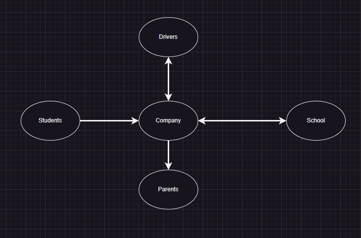
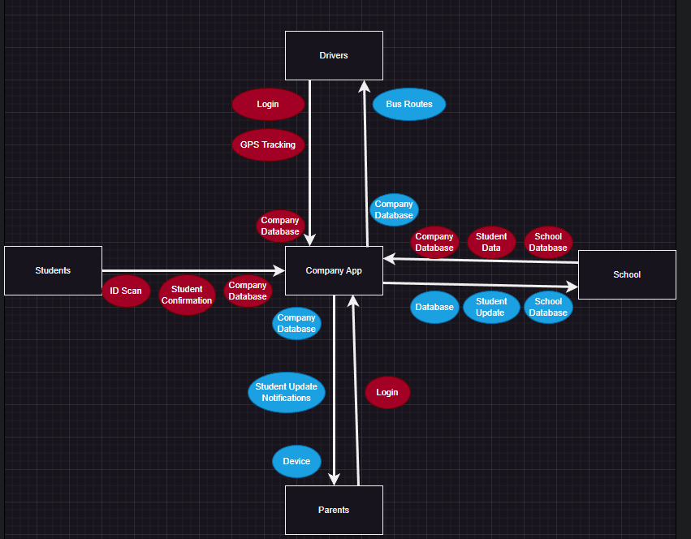
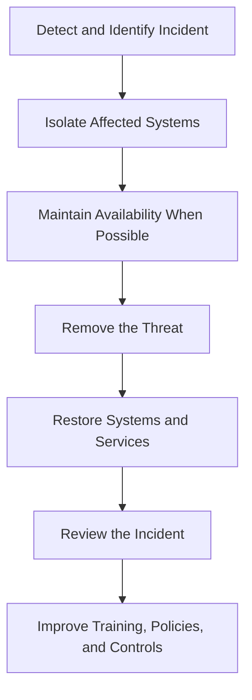

# Information Systems Security Policy Framework 🔐

## Overview

This project is an Information Systems Security Policy framework that I originally completed during my Introduction to Information Security course in October 2024.

The framework was created for **Swift**, a fictional student transportation platform connecting students, parents, drivers, schools, and company personnel. The proposed system would handle sensitive information such as student records, transportation routes, schedules, account information, GPS-related data, and system activity.

The project documents how a fictional organization could approach security governance, risk management, data classification, incident response, access control, system security, vulnerability management, and compliance considerations.

> This is a conceptual academic project. The controls were proposed for a fictional organization and were not implemented, legally reviewed, or tested in a production environment.

## Project Details

- **Course:** Introduction to Information Security
- **Original completion date:** October 2024
- **Project type:** Information Systems Security Policy
- **Organization:** Swift, a fictional student transportation platform
- **Primary focus:** Security governance, risk management, access control, incident response, and policy development

## Project Documentation

The complete project documentation is organized into the following files:

- [Security Policy Framework](./documentation/security-policy-framework.md)
- [SWOT Analysis](./documentation/swot-analysis.md)
- [Future Improvements](./documentation/future-improvements.md)

## Security Objectives

The framework was designed to support:

- **Confidentiality** by restricting access to sensitive student, parent, employee, route, and account information
- **Integrity** by protecting records and monitoring administrative changes
- **Availability** by using monitoring, backups, incident response, and recovery planning
- **Authentication** by verifying users before providing access
- **Authorization** by assigning access based on roles and responsibilities
- **Accountability** through logging, auditing, monitoring, and approval processes

## Stakeholders and System Relationships

The fictional platform was designed to connect several groups:

- Students
- Parents
- Drivers
- Schools
- Company employees
- IT and security personnel
- Approved third-party partners

The following original diagram shows the primary stakeholder relationships:



The company acts as the central organization responsible for managing the platform and protecting the information exchanged between students, parents, drivers, and schools.

## Conceptual System Data Flow

The second original diagram shows the types of information that could move through the company application.



Examples shown in the diagram include:

- User login information
- GPS tracking
- Bus routes
- Student confirmation
- Student updates
- School data
- Company database information
- Parent devices

This is a conceptual data-flow diagram rather than a detailed technical network architecture.

## Policy Areas

### 1. Security Governance

The framework defines responsibilities for:

- Executive management
- Chief Information Security Officer
- Security representatives
- IT management
- Employees and other workforce members

The proposed CISO would establish the overall security direction, advise senior management, review policies, oversee compliance, and ensure security requirements were included in organizational planning.

### 2. Separation of Duties

The framework proposes separating responsibility for:

- Creating security controls
- Reviewing controls
- Approving controls
- Implementing controls
- Auditing control effectiveness

When complete separation is not practical, compensating controls such as logging, monitoring, audit trails, management supervision, and independent approval would be used.

### 3. Information Risk Management

The project identifies risks involving:

- External attackers
- Unauthorized access
- Accidental information disclosure
- Weak passwords
- Excessive user privileges
- Outdated systems
- Third-party weaknesses
- Service interruptions
- Data loss
- Hardware and software vulnerabilities

The framework proposes restricting access to users who are directly involved with the service and requiring verification before granting additional access.

### 4. Information Classification and Handling

The original project proposed several information-classification levels:

| Classification | Example Use |
|---|---|
| Sensitive | Internal policies and general organizational information |
| Personal Private | Student, parent, and employee information |
| Department Private | Routes, budgets, reports, schedules, and departmental communications |
| Organizational Private | Information limited to executives and authorized personnel |
| Confidential | Highly protected information available to specific groups |
| Restricted | The highest level with tightly limited access |
| Undetermined | Information temporarily treated as highly restricted until classified |

The framework also proposed approval requirements for changing classifications.

### 5. Personnel Security

The personnel-security section includes:

- Role-based access
- Access based on information classification
- Multifactor authentication
- Encryption of employee information
- Secure data-transmission methods
- Security-awareness training
- Reporting requirements for suspicious activity

### 6. Cyber Incident Management

The project proposes continuous monitoring through:

- Network-traffic monitoring
- Logs and audit records
- User-activity monitoring
- Automated security alerts
- Partner incident reporting

The documented incident-response process is:



The framework also proposes an incident-response team responsible for communication, coordination, containment, recovery, and post-incident improvement.

### 7. Account Management and Access Control

The proposed account controls include:

- Role-based access control
- Least privilege
- Multifactor authentication
- Identity verification
- Segmentation of users, systems, applications, and data
- Access-request and approval procedures
- Recurring privilege reviews
- Session timeouts
- Progressive account lockouts
- Additional monitoring for privileged users
- Logging of access to sensitive information
- Password managers for employees

For example, parents would only be able to access information associated with their own children.

### 8. System Security

The framework applies security throughout the system lifecycle:

```text
Design
Development and Testing
Production and Distribution
Acquisition and Deployment
Maintenance
Disposal
```

Proposed security activities include:

- Access-control planning
- Vulnerability testing
- Third-party review
- Monitoring
- Patching
- Secure information disposal
- Security testing throughout development

### 9. Local-System Security

Proposed protections for workstations, servers, databases, and applications include:

- Regular updates and patches
- Restricted administrative access
- Approval of third-party software
- Vulnerability assessments
- Endpoint protection
- Group-based permissions

### 10. Network Security

The network-security section proposes:

- Firewalls
- Network segmentation
- Access controls
- Encryption for transmitted information
- Monitoring and automated alerts
- Security reviews
- Endpoint protection
- Authorization before connecting new systems

### 11. Vulnerability Management and Operations Security

The original framework proposes:

- Automated vulnerability scanning
- Manual security reviews
- Security updates and patching
- Log collection
- Review of access and configuration logs
- Daily backups
- Separate backup storage
- Immediate action for major threats
- Recurring reviews of policies and procedures

## SWOT Analysis

The original project also included a cybersecurity-focused SWOT analysis.

| Category | Finding |
|---|---|
| Strength | Encryption could protect sensitive information and increase user trust |
| Weakness | Human error and limited cybersecurity awareness could create vulnerabilities |
| Opportunity | Analytics and route optimization could improve efficiency and service quality |
| Threat | Attackers could target technical systems or users through social engineering |

The full analysis is available here:

[View the SWOT Analysis](./documentation/swot-analysis.md)

## Compliance Considerations

The original project discussed:

- FERPA and educational records
- Accessibility considerations associated with the ADA
- Health-information privacy considerations associated with HIPAA

These were academic compliance considerations, not a legal determination.

Actual regulatory applicability would depend on:

- The organization’s legal role
- The types of information processed
- Relationships with schools and other organizations
- Applicable jurisdictions
- Contractual responsibilities
- Formal legal and compliance review

## Skills Demonstrated

- Information security policy development
- Security governance
- Risk identification
- Data classification
- Incident-response planning
- Access-control planning
- Least privilege
- Multifactor authentication planning
- Separation of duties
- Vulnerability-management planning
- SWOT analysis
- Compliance awareness
- Security documentation
- Stakeholder analysis

## Key Takeaways

This project helped me understand that cybersecurity includes more than technical tools.

An organization also needs:

- Clearly assigned responsibilities
- Documented policies
- Risk-management processes
- Defined access rules
- Incident-response procedures
- Data-classification standards
- Monitoring and accountability
- User training
- Backup and recovery planning
- Recurring review and improvement

The biggest takeaway was that technical controls need to be supported by governance, policies, responsibilities, and documented procedures.

## Project Limitations

- The organization and system were fictional
- The controls were proposed rather than implemented
- No production risk assessment was performed
- No legal applicability assessment was completed
- No technical control testing was performed
- Some requirements would need revision before being used by a real organization
- The original diagrams are conceptual rather than detailed technical architectures

## Future Improvements

The project includes a separate future-improvements document covering possible revisions such as:

- Simplifying the data-classification model
- Modernizing authentication requirements
- Creating risk-based patch deadlines
- Expanding encryption and key-management requirements
- Formalizing incident-response procedures
- Creating a risk register
- Adding third-party risk requirements
- Mapping controls to a recognized cybersecurity framework
- Verifying regulatory applicability
- Testing control effectiveness
- Improving the architecture diagrams

[View Future Improvements](./documentation/future-improvements.md)

## Project History

I originally completed this project in 2024 during my Introduction to Information Security course.

The two diagrams come from my original submission. The GitHub version was created later to:

- Organize the project into separate Markdown documents
- Improve readability
- Correct minor wording and formatting issues
- Clarify that the organization was fictional
- Separate original work from later reflections
- Avoid overstating compliance or control effectiveness

The original Word document and SWOT draft are not included because their content has been reorganized into the documentation provided in this repository.

## Repository Structure

```text
information-systems-security-policy-framework/
├── README.md
├── diagrams/
│   ├── 01-stakeholder-relationships.png
│   └── 02-conceptual-system-data-flow.png
└── documentation/
    ├── security-policy-framework.md
    ├── swot-analysis.md
    └── future-improvements.md
```
